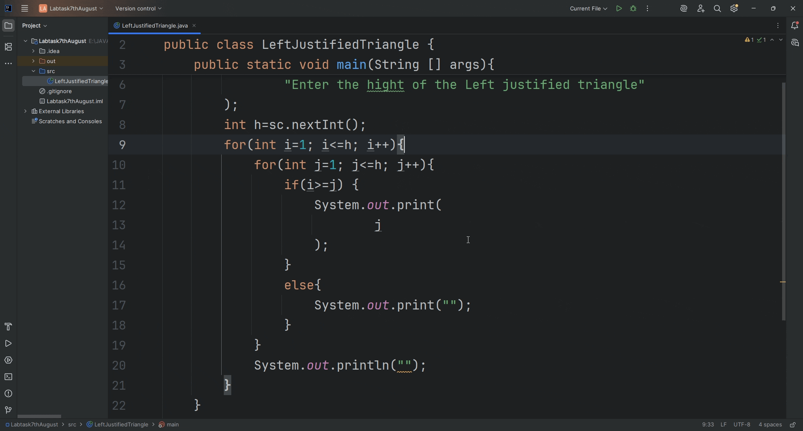

# From 1 to Triangle

> Ever wonder how far the number 1 can go?

This isn't just a triangle. It's a glimpse into how a few lines of code can turn logic into patterns. Enter a number, and watch as a triangle forms—line by line, digit by digit.

This project turns simple loops into a visual rhythm—perfect for beginners who want to crack the code behind code.

---
### 🎥 Demo Output



*This simple Java program prints a left-justified triangle of numbers.*

## How to Run

1. Clone this repository:
   ```bash
   git clone https://github.com/AtikHD/LeftJustifiedTriangle.git
   cd LeftJustifiedTriangle
java LeftJustifiedTriangle
